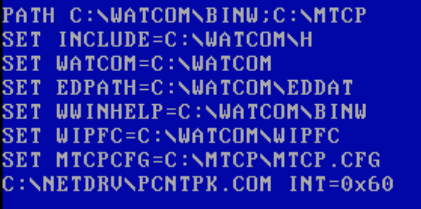
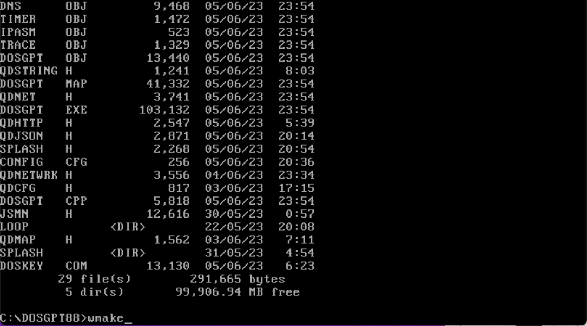
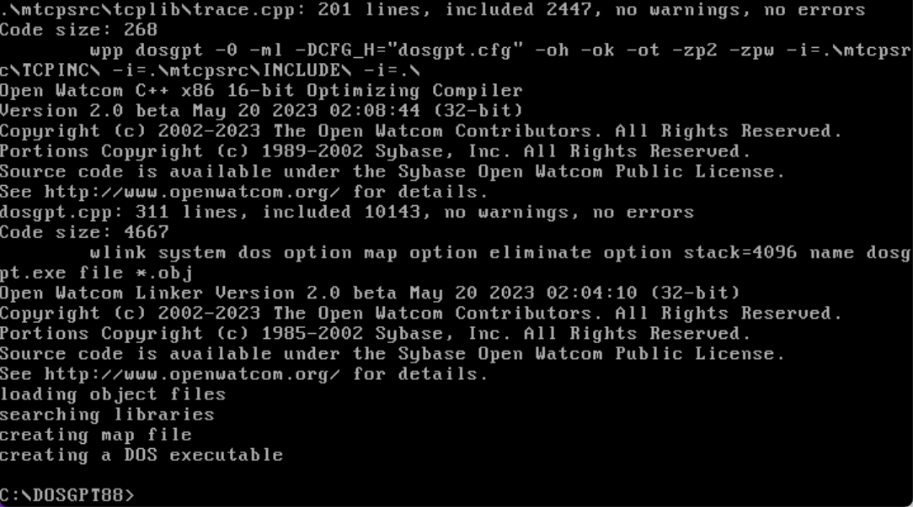
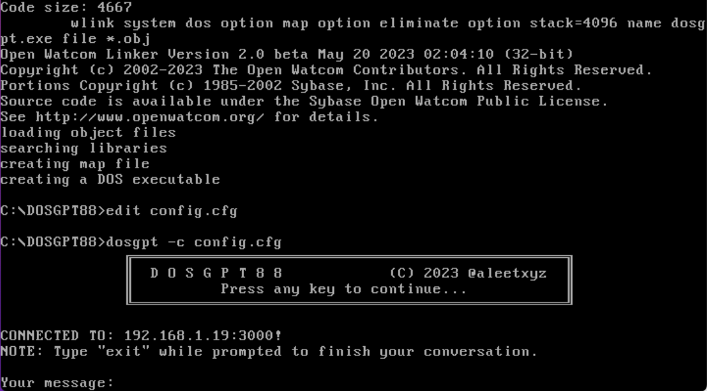
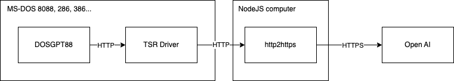

# DOSGPT

A ChatGPT MS-DOS PoC client for 8088 class computers, made in C 


### Motivation

Back in 2012 i [connected](https://www.youtube.com/watch?v=V_Jg2VJbwUw) my hobbyst DOS 386-DLC PC into the net using a 3COM 3c509 NIC with MTCP, i haven't stopped learning since then, moreover, the inspiration of Yeo Kheng Meng's [DOSCHGPT](https://github.com/yeokm1/doschgpt) made me recover my passion for vintage computing, and this is the result!

## Features

Features? You're messaging with ChatGPT on a 40+ yr old (2023) computer!!! Chat history and conversations are vanities for the scope of this toy project. Anyway i'll keep an eye on this repo.

*Notice*: **this computer program is not meant for production purposes, but computer enthusiasts and hobbysts**.

## Pre-requisites

### Target machine

#### Hardware

- 8088 compatible computer (Tested on an IBM PC model 5160)

- 4 Kb free RAM 

- Ethernet NIC card installed (Tested with 3COM 3C503 TP)

##### Software

- **MS-DOS 6.22** (Not tested on early vesions)

- **Packet Driver** TSR (Head over to http://crynwr.com/ to find the correct drivers for your NIC)

- **MTCP** (A collection of TCP/IP applications in MS-DOS), available in [here](http://brutmanlabs.org/mTCP/)!

- **Open AI account** with a valid [API token](https://platform.openai.com/account/api-keys)

### Proxy machine

- A modern computer with **NodeJS** installed and network access

### Compilation Machine

- A **Windows 98** (recommended) virtual computer, you can acquire a copy of a virtual hard disk for **VMWare** right [here](https://archive.org/details/windows-98se-vmdk)

- **Open Watcom** 2.0b (C, C++ compiler that supports 8088 architectures), check it out in [here](http://open-watcom.github.io/)

- **MTCP** C source libraries available in [here](http://brutmanlabs.org/mTCP/)!

## Compilation and execution

### Preparation

You can drag & drop the files contained within the source folder into the virtual machine via Windows 98. Then you can return to MSDOS to continue with the compilation.

### Compilation

Make sure you have Open Watcom 2.0b + the corresponding packet driver installed on MS-DOS (For the recommended Win98 virtual computer, the correct driver for MS-DOS can be found here [PCNTPK.COM](http://www.georgpotthast.de/sioux/packet.htm))

Your `autoexec.bat` should have these lines added up, something like this:



Now let's dive directly into MS-DOS! 

> You can compile the program too under Win98 prompt, but since Win98 includes it's own network stack, you won' be able to run the program from the shell window.



Simply head over to the source folder and run wmake, and you should be good to go.



### Proxy server

It's a fact that HTTPS adds and extra layer of security over plain HTTP, the thing is that executing cryptographic operations is overkilling a 8088-based machine, therefore we need an extra application layer inside our small architecture that "upgrades" HTTP requests into HTTPS.

> A normal HTTP proxy via `CONNECT` method won't work this is because TLS operations are done by the client and the end server, thus leaving the HTTP client the responsibility to deal with HTTPS  

Locate your preferred shell within the `proxy` folder and run the installation script

`npm install` or `yarn install`

Then just run the proxy server as a usual NodeJS application

`node http2https.js`

### Configuration

You'll need a `config.cfg` file that describes the following options:

```
#PROXY SERVER ADDRESS
PRXYNAME=<PROXY SERVER ADDRESS>
#PROXY SERVER PORT
PRXYPORT=<PROXY SERVER PORT>
#CHAT GPT API TOKEN
GPTTOKEN=<YOUR OPEN AI TOKEN>
#CHAT GPT API PATH
GPTRPATH=/v1/chat/completions
#CHAT GPT MODEL
GPTMODEL=gpt-3.5-turbo
#CHAT GPT REPSPONSE RANDOMNESS
GPTTEMPR=0.7
#RESPONSE TIMEOUT IN MS
RECVTOUT=15000
```

Specifiy your custom options without the <> nor """

### Execution

To run the application, just write the command:

`dosgpt.exe -c config.cfg`

The `-c` option specifies the path of the configuration file  



You can specify the `-s` option to appreciate the [cp437]([Code page 437 - Wikipedia](https://en.wikipedia.org/wiki/Code_page_437)) splash art 

#### How can i pass the executable into my vintage computer?

You can use MTCP's `FTPSRV` tool to mount a plain FTP server within your local network, then on the target machine use MTCP `FTP` client to retrieve the compiled `dosgpt.exe` file. More information about this great MS-DOS application [here](http://brutmanlabs.org/mTCP/mTCP_FTPSrv.html))

**And that's it you're ready to chat with ChatGPT via MS-DOS !!**

#### Architectural details



### COMING SOON

**Blog with entries that detail all the technical stuff no one wants to know!!**
